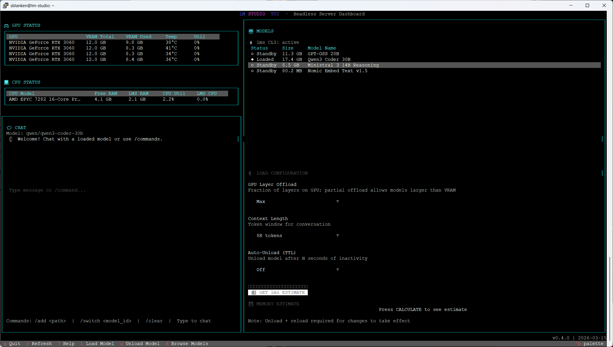

# Lieutenant-Underwood (LTU)
## LM Studio Terminal User Interface

**A Terminal UI for monitoring and managing an LM Studio headless inference server.**

Named in the tradition of military brevity: *Lieutenant Underwood* reports for duty as **LT U** — your **L**M-Studio **T**erminal **U**ser-interface.

```
╔════════════════════════════════════════════════════════╗
║  Lieutenant-Underwood v0.4.0                           ║
║  LM Studio Terminal User Interface                     ║
╚════════════════════════════════════════════════════════╝
```

---

## Features

- **GPU STATUS** — Real-time metrics for all NVIDIA GPUs: utilization %, VRAM used/total, temperature, power draw
- **CPU STATUS** — Live system overview: CPU model, free RAM, LM Studio RAM usage, CPU utilization, LM Studio CPU %
- **MODELS Panel** — Browse, configure, load, and unload models with full control over GPU offload %, context length, and TTL auto-unload
- **CHAT Panel** — Send messages to a loaded model with live streaming response; slash commands for quick model switching
- **Model Browser** — Search and download models from Hugging Face directly within the TUI (powered by `lms get`)
- **Download Monitor** — Live download progress display with cancel support; downloads survive TUI restarts
- **Hybrid Load Path** — Uses the `lms` CLI for model loading when available (unlocks GPU layer offload and TTL); falls back to REST API automatically
- **VRAM Estimation** — Real VRAM estimates via `lms load --estimate-only` before committing to a load

---

## Screenshot



*Live dashboard: 4× NVIDIA RTX 3060 (48 GB VRAM total) · Qwen3 Coder 30B loaded · lms CLI active*

---

## Prerequisites

Before installing Lieutenant-Underwood, ensure the following are in place:

| Requirement | Notes |
|-------------|-------|
| **Linux** | Ubuntu 20.04+ recommended (tested on Ubuntu 24.04) |
| **Python 3.9+** | With `python3-venv` (`sudo apt install python3-venv`) |
| **git** | For cloning during install |
| **curl** | For downloading releases |
| **LM Studio** | Installed and accessible; the `lms` CLI at `~/.lmstudio/bin/lms` |
| **NVIDIA GPU + drivers** | Optional — GPU STATUS panel requires PyNVML/NVIDIA drivers |

All Python dependencies (Textual, httpx, psutil, pynvml, tomli, dacite, etc.) are installed automatically by the installer.

---

## Installation

```bash
# Download the installer
curl -sL https://raw.githubusercontent.com/o3willard-AI/Lieutenant-Underwood/master/scripts/install.sh -o install.sh

# Install (requires sudo)
sudo bash install.sh
```

The installer will:
1. Check Python version and `venv` availability
2. Download the latest release from GitHub
3. Create `/opt/lieutenant-underwood/` with an isolated Python venv
4. Install all dependencies into the venv
5. Create the `/usr/local/bin/lmstui` launcher
6. Write a default config to `~/.config/lmstudio-tui/config.toml`

### Upgrade

```bash
sudo bash install.sh --upgrade
```

Stops any running instance, downloads the latest release, updates source files, and upgrades pip packages in place. User config is preserved.

### Uninstall

```bash
sudo /opt/lieutenant-underwood/uninstall.sh
# or
sudo bash install.sh --uninstall
```

Removes `/opt/lieutenant-underwood/` and `/usr/local/bin/lmstui`. User config at `~/.config/lmstudio-tui/` is **preserved** — remove it manually if desired:

```bash
rm -rf ~/.config/lmstudio-tui/
```

---

## Usage

```bash
# Launch (LM Studio must be running or you will be prompted)
lmstui

# Options
lmstui --host 192.168.1.10   # Connect to remote LM Studio
lmstui --port 1235            # Override port (default: auto-detect)
lmstui --debug                # Enable debug logging
lmstui --version              # Show version
```

On launch, the TUI checks Python version, verifies LM Studio is installed, then auto-detects which port (1234–1240) LM Studio is responding on. If LM Studio is not running, you will be asked whether to start it.

---

## Layout

```
┌─────────────────────────────────────────────────────────────────────┐
│  ASCII Logo / Banner                                                │
├──────────────────────────────┬──────────────────────────────────────┤
│  💻 GPU STATUS               │  🤖 MODELS                          │
│  (per-GPU table)             │  (model list with status/size/quant) │
├──────────────────────────────│                                      │
│  🖥 CPU STATUS               │  LOAD CONFIGURATION frame           │
│  (CPU/RAM table)             │  (GPU offload, context, TTL)         │
├──────────────────────────────│                                      │
│  💬 CHAT                     │  DOWNLOAD PROGRESS (when active)    │
│  (streaming chat / commands) │                                      │
└──────────────────────────────┴──────────────────────────────────────┘
```

---

## Keybindings

### Global

| Key | Action |
|-----|--------|
| `q` | Quit |
| `r` | Refresh all data |
| `?` | Show help |
| `Tab` | Focus next panel |

### Models Panel (when focused)

| Key | Action |
|-----|--------|
| `↑` / `↓` | Navigate model list |
| `Enter` | Open model detail screen |
| `l` | Load selected model (uses LOAD CONFIGURATION settings) |
| `u` | Unload selected model |
| `r` | Refresh model list |
| `d` | Open model browser (Hugging Face search & download) |

### Chat Panel

| Command | Action |
|---------|--------|
| (type message) | Send to loaded model with streaming response |
| `/switch <model_id>` | Set active model for chat |
| `/add <local_path>` | Import a local model file into LM Studio |
| `/clear` | Clear chat history |
| `/help` | Show available commands |

---

## Configuration

Config file: `~/.config/lmstudio-tui/config.toml`

```toml
[server]
host = "localhost"      # LM Studio server hostname or IP
port = 1234             # Override port (default: auto-detect 1234–1240)
timeout = 10.0          # HTTP request timeout in seconds
retry = true            # Retry on transient errors
verify_ssl = true       # Verify SSL certificates (for HTTPS servers)
# api_token_path = "~/.lmstudio/token"  # Path to API auth token file

[gpu]
monitoring_enabled = true
update_frequency = 1.0  # Seconds between GPU/CPU metric polls

[chat]
system_prompt = "You are a helpful assistant."

[app]
# lms_cli_path = "/custom/path/to/lms"  # Override lms binary location

[alerts.temperature]
warning = 80    # °C
critical = 90

[alerts.vram]
warning = 95    # % VRAM used
critical = 98
```

### lms CLI Auto-Detection

Lieutenant-Underwood looks for the `lms` binary in this order:
1. `lms_cli_path` from `[app]` section of config (if set)
2. `~/.lmstudio/bin/lms` (standard LM Studio install location)
3. `lms` on `$PATH` (via `which lms`)

If `lms` is found, the MODELS panel shows **⚡ lms CLI: active** and full GPU offload / TTL support is enabled. If not found, a warning is shown and model loading falls back to the REST API (no GPU offload or TTL).

### Load Configuration Options

These options appear in the MODELS panel when a model is selected:

| Option | Description |
|--------|-------------|
| **GPU Layer Offload** | Fraction of model layers on GPU: `Max` (auto), `75%`, `50%`, `25%`, `0%` (CPU only). Partial offload allows models larger than available VRAM. |
| **Context Length** | Token context window: 8K–262K, or `Auto (Max VRAM)` / `Auto (Model Max)`. |
| **Auto-Unload (TTL)** | Automatically unload after N seconds of inactivity: Off, 1 min, 5 min, 30 min, 1 hour. |

Press **CALCULATE** to get a real VRAM estimate from `lms load --estimate-only` before loading.

---

## Development

```bash
# Clone
git clone https://github.com/o3willard-AI/Lieutenant-Underwood
cd Lieutenant-Underwood

# Set up dev environment (using uv)
uv sync

# Run tests
uv run --with "pytest>=7,pytest-asyncio>=0.21" pytest tests/ -v --tb=short
# Expected: ~142 passed, 16 skipped (hardware GPU tests), 0 failed

# Run the TUI in development
uv run python -m lmstudio_tui.launcher
```

### Project Structure

```
src/lmstudio_tui/
├── __init__.py          # Version
├── app.py               # Textual App root, background workers
├── config.py            # AppConfig dataclass + TOML load/save
├── launcher.py          # lmstui entry point with pre-flight checks
├── store.py             # Singleton RootStore with ReactiveVar state
├── utils.py             # format_size(), extract_quantization()
├── api/
│   └── client.py        # httpx async client for LM Studio REST API
├── cli/
│   └── lms_cli.py       # lms subprocess wrapper (load, estimate, download)
├── cpu/
│   └── monitor.py       # CPUMonitor using psutil
├── gpu/
│   └── monitor.py       # GPUMonitor using PyNVML
├── screens/
│   ├── main_screen.py          # Main dashboard layout
│   ├── model_detail_screen.py  # Per-model detail and load screen
│   └── model_browser_screen.py # Hugging Face model search/download
└── widgets/
    ├── ascii_logo.py    # Banner logo
    ├── chat_panel.py    # Streaming chat interface
    ├── cpu_panel.py     # CPU/RAM status table
    ├── gpu_panel.py     # GPU metrics table
    └── models_panel.py  # Model list + load configuration
```

---

## Hardware Tested

- **Server:** Ubuntu 24.04, LM Studio headless
- **GPUs:** 4× NVIDIA GeForce RTX 3060 12GB (48 GB total VRAM)
- **Models tested:** Qwen3-Coder-30B, Ministral-3B/14B, Nomic-Embed-Text

---

## Logs

Application logs are written to `~/.local/share/lmstudio-tui/app.log` with automatic rotation (5 MB max, 3 backups). Enable verbose logging with `lmstui --debug`.

---

## License

MIT — See [LICENSE](LICENSE) for details.

---

**LTU standing by.** 🤖⚡
