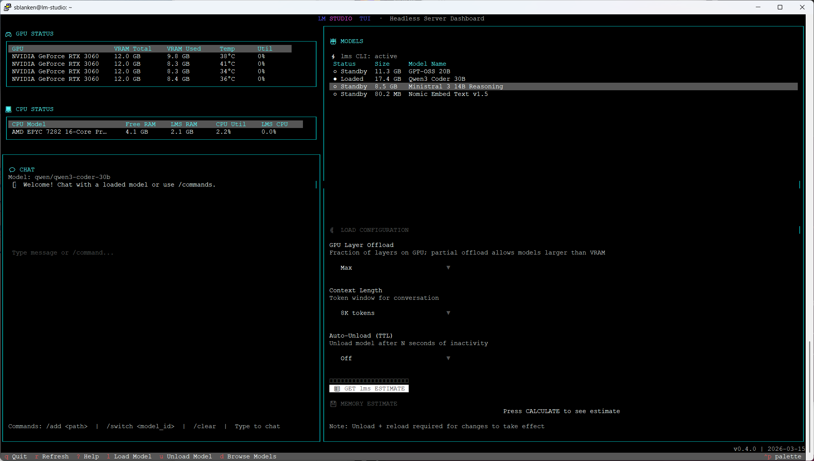

# Lieutenant-Underwood (LTU)
## LM Studio Terminal User Interface

**A Terminal UI for monitoring and managing an LM Studio headless inference server.**

Named in the tradition of military brevity: *Lieutenant Underwood* reports for duty as **LT U** — your **L**M-Studio **T**erminal **U**ser-interface.

```
╔════════════════════════════════════════════════════════╗
║  Lieutenant-Underwood v0.8.5                           ║
║  LM Studio Terminal User Interface                     ║
╚════════════════════════════════════════════════════════╝
```

---

## Features

- **GPU STATUS** — Real-time metrics for all NVIDIA GPUs: utilization %, VRAM used/total, temperature, power draw
- **CPU STATUS** — Live system overview: CPU model, free RAM, LM Studio RAM usage, CPU utilization, LM Studio CPU %
- **MODELS Panel** — Browse and select models; press Enter to open the detail screen for load configuration (GPU offload %, context length, TTL auto-unload) and VRAM estimates
- **PERFORMANCE Panel** — Real-time inference metrics: TPS (now/peak/avg), TTFT avg, total requests, total tokens out, and context utilization bar. Tracks both TUI-initiated chat *and* external API clients via passive network sniffing
- **CHAT Panel** — Send messages to a loaded model with live streaming response; slash commands for model switching, import, and calibration
- **Model Browser** — Two-step search and download from Hugging Face: browse repos by downloads/stars/date, then select a specific quantization variant (Q4_K_M, Q8_0, etc.) with file sizes shown. Downloads stream directly from huggingface.co — works for any public GGUF model, not just the LM Studio catalog
- **Download Monitor** — Live progress display with bytes received, speed (MB/s), and cancel support. Downloaded files are placed in `~/.lmstudio/models/` where LM Studio picks them up automatically
- **Hybrid Load Path** — Uses the `lms` CLI for model loading when available (unlocks GPU layer offload and TTL); falls back to REST API automatically

---

## Screenshot



*Live dashboard: 4× NVIDIA RTX 3060 (48 GB VRAM total) · Qwen3 Coder 30B loaded · lms CLI active*

---

## Prerequisites

| Requirement | Notes |
|-------------|-------|
| **Linux** | Ubuntu 20.04+ recommended (tested on Ubuntu 24.04) |
| **Python 3.9+** | With `python3-venv` (`sudo apt install python3-venv`) |
| **git** | For cloning during install |
| **curl** | For downloading releases |
| **libcap2-bin** | For `setcap` (network sniffer privilege grant); `sudo apt install libcap2-bin` |
| **LM Studio** | Installed and accessible; the `lms` CLI at `~/.lmstudio/bin/lms` |
| **NVIDIA GPU + drivers** | Optional — GPU STATUS panel requires PyNVML/NVIDIA drivers |

All Python dependencies (Textual, httpx, psutil, pynvml, scapy, tomli, dacite, etc.) are installed automatically by the installer.

---

## Installation

### Fresh Install

```bash
# Download the installer
curl -sL https://raw.githubusercontent.com/o3willard-AI/Lieutenant-Underwood/master/scripts/install.sh -o install.sh

# Install (requires sudo)
sudo bash install.sh
```

The installer will:
1. Check Python version and `venv` availability
2. Download the latest release from GitHub
3. Create `/opt/lieutenant-underwood/` with an isolated Python venv
4. Install all dependencies into the venv (including scapy for network sniffing)
5. Grant `CAP_NET_RAW` to the venv Python so the network sniffer can open raw sockets
6. Create the `/usr/local/bin/lmstui` launcher
7. Write a default config to `~/.config/lmstudio-tui/config.toml`

After installation, launch with:

```bash
lmstui
```

> **Note on network sniffing:** Step 5 runs `setcap cap_net_raw+eip` on the venv's Python binary so the PERFORMANCE panel can track external API clients via passive HTTP sniffing (no proxy, no traffic modification). If `libcap2-bin` is not installed the installer prints a warning and continues; all other features work normally, and GPU-utilization-based TPS estimation remains active as a fallback.

---

### Upgrade

The install script must be re-downloaded before upgrading, as it is not stored in `/opt/lieutenant-underwood/` after a fresh install.

```bash
# Re-download the latest installer
curl -sL https://raw.githubusercontent.com/o3willard-AI/Lieutenant-Underwood/master/scripts/install.sh -o install.sh

# Upgrade in place (requires sudo)
sudo bash install.sh --upgrade
```

This will:
- Stop any running `lmstui` process
- Download the latest source from GitHub
- Replace the application files in `/opt/lieutenant-underwood/src/`
- Run `pip install --upgrade` inside the venv
- Re-apply `setcap` in case the Python binary changed
- Recreate the `/usr/local/bin/lmstui` launcher

Your config at `~/.config/lmstudio-tui/config.toml` is **not touched**.

---

### Uninstall

```bash
# Re-download the installer
curl -sL https://raw.githubusercontent.com/o3willard-AI/Lieutenant-Underwood/master/scripts/install.sh -o install.sh

# Uninstall (requires sudo)
sudo bash install.sh --uninstall
```

If the installer placed an `uninstall.sh` in `/opt/lieutenant-underwood/` you can also run it directly:

```bash
sudo bash /opt/lieutenant-underwood/uninstall.sh
```

Either method removes `/opt/lieutenant-underwood/` and `/usr/local/bin/lmstui`.

User config at `~/.config/lmstudio-tui/` is **preserved**. Remove it manually if desired:

```bash
rm -rf ~/.config/lmstudio-tui/
```

---

## Usage

```bash
# Launch (LM Studio must be running or you will be prompted)
lmstui

# Options
lmstui --host 192.168.1.10   # Connect to remote LM Studio
lmstui --port 1235            # Override port (default: auto-detect)
lmstui --debug                # Enable debug logging
lmstui --version              # Show version
```

On launch, the TUI checks Python version, verifies LM Studio is installed, then auto-detects which port (1234–1240) LM Studio is responding on. If LM Studio is not running, you will be asked whether to start it.

---

## Layout

All panels stack in a single full-width column:

```
┌──────────────────────────────────────────────────────┐
│  ASCII Logo / Banner                                 │
├──────────────────────────────────────────────────────┤
│  💻 GPU STATUS                                       │
│  utilization % · VRAM used/total · temp · power      │
├──────────────────────────────────────────────────────┤
│  🖥  CPU STATUS                                      │
│  model · free RAM · LM Studio RAM · CPU % · LMS CPU% │
├──────────────────────────────────────────────────────┤
│  🤖 MODELS                                           │
│  model list with status, size, quantization          │
│  (press Enter to open detail/load screen)            │
├──────────────────────────────────────────────────────┤
│  ⚡ PERFORMANCE                                      │
│  TPS now · TPS peak · TPS avg · TTFT avg             │
│  Requests · Tokens out · Context utilization bar     │
├──────────────────────────────────────────────────────┤
│  💬 CHAT                                             │
│  streaming chat · slash commands                     │
└──────────────────────────────────────────────────────┘
```

---

## Keybindings

### Global

| Key | Action |
|-----|--------|
| `q` | Quit |
| `?` | Show help |
| `Tab` | Focus next panel |
| `d` | Open model browser (Hugging Face search & download) |

### Models Panel (when focused)

| Key | Action |
|-----|--------|
| `↑` / `↓` | Navigate model list |
| `Enter` | Open model detail screen (configure, load, unload) |
| `d` | Open model browser |

### Model Detail Screen

Load configuration lives here, not on the main panel:

| Control | Description |
|---------|-------------|
| **GPU Layer Offload** | `Max` (auto), `75%`, `50%`, `25%`, `CPU only` |
| **Context Length** | 8K–262K (auto-estimates VRAM for each option) |
| **Auto-Unload (TTL)** | Off, 1 min, 5 min, 30 min, 1 hour |
| **Load** button | Loads the model with the selected settings |
| **Unload** button | Unloads the currently loaded model |

VRAM estimates (Q4_0 low / Q8_0 mid / F16 high) update instantly as you change settings — no button required.

### Model Browser

| Key / Button | Action |
|---|---|
| `↑` / `↓` | Navigate repo list or file list |
| `⬇ Select File` | Open quantization picker for selected repo |
| `Enter` | Same as Select File (in browse mode) |
| `⬇ Download` | Start download of selected `.gguf` file |
| `← Back` / `Esc` | Return to repo list from file picker |
| `Close` / `Esc` | Close the browser |

### Chat Panel

| Command | Action |
|---------|--------|
| (type message) | Send to loaded model with streaming response |
| `/switch <model_id>` | Set active model for chat |
| `/add <local_path>` | Import a local model file into LM Studio |
| `/clear` | Clear chat history |
| `/cal` | Run calibration prompt (~5 k tokens) to prime the GPU/TPS estimator |
| `/help` | Show available commands |

### Theme Switcher

| Key | Action |
|-----|--------|
| `Ctrl+P` | Open command palette |

Type **Theme** in the palette then select from the full list. The current theme is marked **(current)** and the built-in default is marked **(default)**. A toast notification confirms every change. 20 themes are available including `nord`, `dracula`, `gruvbox`, `catppuccin-mocha`, `tokyo-night`, and more.

---

## PERFORMANCE Panel

The PERFORMANCE panel shows seven inference metrics that update every second:

| Metric | Description |
|--------|-------------|
| **TPS (now)** | Rolling tokens/sec over the last 5 seconds. Shows `~` prefix when value is GPU-estimated rather than exact |
| **TPS (peak)** | Highest tokens/sec burst seen this session |
| **TPS (avg)** | Session-wide average tokens/sec |
| **TTFT avg** | Average time-to-first-token in ms, computed over the last 3 completed requests |
| **Requests** | Total completed inference requests since the TUI started |
| **Tokens out** | Total output tokens generated this session |
| **Context bar** | Prompt tokens vs. loaded model's context window (green < 70 %, yellow 70–90 %, red > 90 %) |

All counters reset when the TUI restarts.

### How external inference is tracked

The TUI can only directly instrument requests it sends itself. Two mechanisms cover external API clients:

1. **Passive HTTP sniffer** (primary) — scapy watches all network interfaces for plain HTTP traffic on the LM Studio port. Each SSE `data:` event in a server→client packet is counted as one output token; TTFT is measured from TCP SYN to first token packet; the request counter increments on `data: [DONE]`. Requires `CAP_NET_RAW` (granted automatically by the installer).

2. **GPU-utilization estimation** (fallback) — if the sniffer is unavailable, the GPU worker maintains a calibration ratio (tokens/sec ÷ GPU%) derived from observed TUI chat sessions via EMA. When the GPU exceeds 20 % utilization with no active TUI request, TPS (now) is estimated as `ratio × current GPU%` and marked with a `~` prefix. Run `/cal` in the CHAT panel to build the ratio quickly with a sustained ~5 k-token response.

---

## Configuration

Config file: `~/.config/lmstudio-tui/config.toml`

```toml
[server]
host = "localhost"      # LM Studio server hostname or IP
port = 1234             # Override port (default: auto-detect 1234–1240)
timeout = 10.0          # HTTP request timeout in seconds
retry = true            # Retry on transient errors
verify_ssl = true       # Verify SSL certificates (for HTTPS servers)
# api_token_path = "~/.lmstudio/token"  # Path to API auth token file

[gpu]
monitoring_enabled = true
update_frequency = 1.0  # Seconds between GPU/CPU metric polls

[chat]
system_prompt = "You are a helpful assistant."

[app]
# lms_cli_path = "/custom/path/to/lms"  # Override lms binary location
```

### lms CLI Auto-Detection

Lieutenant-Underwood looks for the `lms` binary in this order:
1. `lms_cli_path` from `[app]` section of config (if set)
2. `~/.lmstudio/bin/lms` (standard LM Studio install location)
3. `lms` on `$PATH` (via `which lms`)

If `lms` is found, the MODELS panel shows **⚡ lms CLI: active** and full GPU offload / TTL support is enabled. If not found, a warning is shown and model loading falls back to the REST API (no GPU offload or TTL).

---

## Development

```bash
# Clone
git clone https://github.com/o3willard-AI/Lieutenant-Underwood
cd Lieutenant-Underwood

# Set up dev environment (using uv)
uv sync

# Run tests
uv run --with "pytest>=7,pytest-asyncio>=0.21" pytest tests/ -v --tb=short
# Expected: ~142 passed, 16 skipped (hardware GPU tests), 0 failed

# Run the TUI in development
uv run python -m lmstudio_tui.launcher
```

### Project Structure

```
src/lmstudio_tui/
├── __init__.py          # Version
├── app.py               # Textual App root, background workers
├── config.py            # AppConfig dataclass + TOML load/save
├── downloader.py        # Direct HF streaming downloader (bypasses lms get)
├── launcher.py          # lmstui entry point with pre-flight checks
├── store.py             # Singleton RootStore with ReactiveVar state
├── utils.py             # format_size(), extract_quantization()
├── api/
│   └── client.py        # httpx async client for LM Studio REST API
├── cli/
│   └── lms_cli.py       # lms subprocess wrapper (load and estimate only)
├── cpu/
│   └── monitor.py       # CPUMonitor using psutil
├── gpu/
│   └── monitor.py       # GPUMonitor using PyNVML
├── network/
│   └── http_sniffer.py  # Passive scapy sniffer for external inference tracking
├── screens/
│   ├── main_screen.py          # Main dashboard layout (single column)
│   ├── model_detail_screen.py  # Per-model detail, load config, and load/unload
│   └── model_browser_screen.py # Hugging Face model browser (browse → file picker)
└── widgets/
    ├── ascii_logo.py        # Banner logo
    ├── chat_panel.py        # Streaming chat interface + slash commands
    ├── cpu_panel.py         # CPU/RAM status table
    ├── gpu_panel.py         # GPU metrics table
    ├── models_panel.py      # Model list + download status
    └── performance_panel.py # Real-time inference metrics
```

---

## Hardware Tested

- **Server:** Ubuntu 24.04, LM Studio headless
- **GPUs:** 4× NVIDIA GeForce RTX 3060 12GB (48 GB total VRAM)
- **Models tested:** Qwen3-Coder-30B, Ministral-3B/14B, Nomic-Embed-Text

---

## Logs

Application logs are written to `~/.local/share/lmstudio-tui/app.log` with automatic rotation (5 MB max, 3 backups). Enable verbose logging with `lmstui --debug`.

---

## License

MIT — See [LICENSE](LICENSE) for details.

---

**LTU standing by.** 🤖⚡
